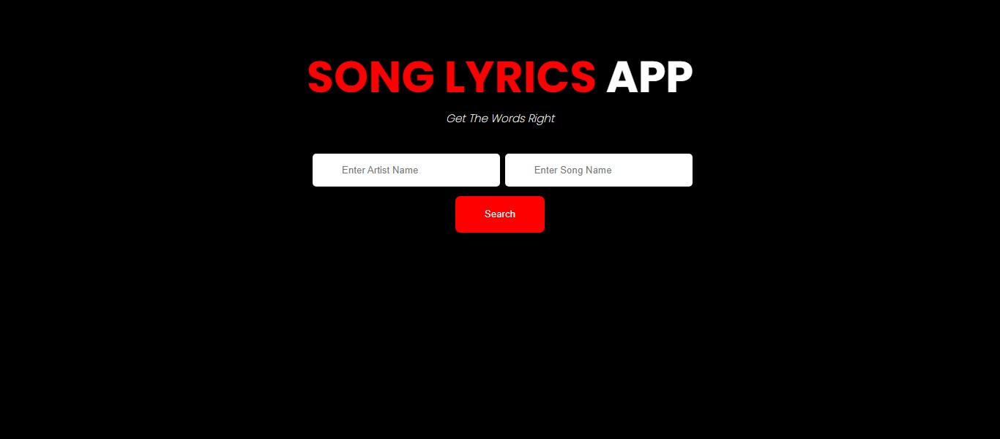

# Song Lyrics App

This is an app made with ReactJS that  renders lyrics of songs to users. As a music lover i decided to make an app so i can get lyrics of my favourite songs.

## Table of contents

- [Overview](#overview)
- [Screenshot](#Screenshot)

  - [Links](#links)
- [My process](#my-process)
  - [Built with](#built-with)
  
- [Author](#author)

**Note: Delete this note and update the table of contents based on what sections you keep.**

## Overview
- User needs to input song name and Artist name 
- Click the search button to get the lyrics.
- An Api is responsible for fetcthing the lyrics

## Screenshot

### Links

- Solution URL: [Github Repository](https://github.com/obinneji/songlyrics-app/)
- Live Site URL: [Songlyrics-app](https://songlyrics-app.vercel.app/)

## My process
- Created a react App
- created state for the lyrics 
- using axios for the Api call.

### Built with

- Semantic HTML5 markup
- CSS custom properties
- Flexbox
- Javascript
- ReactJS
- use of RapidApi

## Author

- Frontend Mentor - [obinneji](https://www.frontendmentor.io/profile/obinneji)
- Twitter - [Obinneji Francis](https://www.twitter.com/francisobinneji)
- Linkedin-[Obinneji Chibuzor](https://www.linkedin.com/obinneji/)

